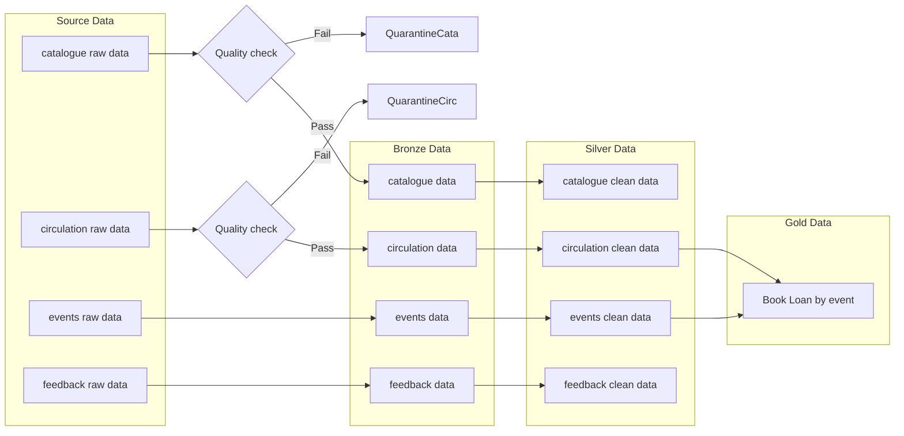

# Architecture Decision Record

# Medallion Architecture - Group 2
!!! Info "Test info"
!!! Notes "note info"
## heading 1
- bullet 1
- bullet 2

## Task

Create a Mermaid diagram showing how this pipeline should be organised into Bronze, Silver and Gold layers.

Your diagram should show:

- source data
- Bronze layer
- Silver layer
- Gold layer
- at least one data quality or validation step
- at least one final output for a user or stakeholder

## Diagram

## Questions to answer:

### One design decision
- We decided to...

### One question or risk
- We are unsure about...
